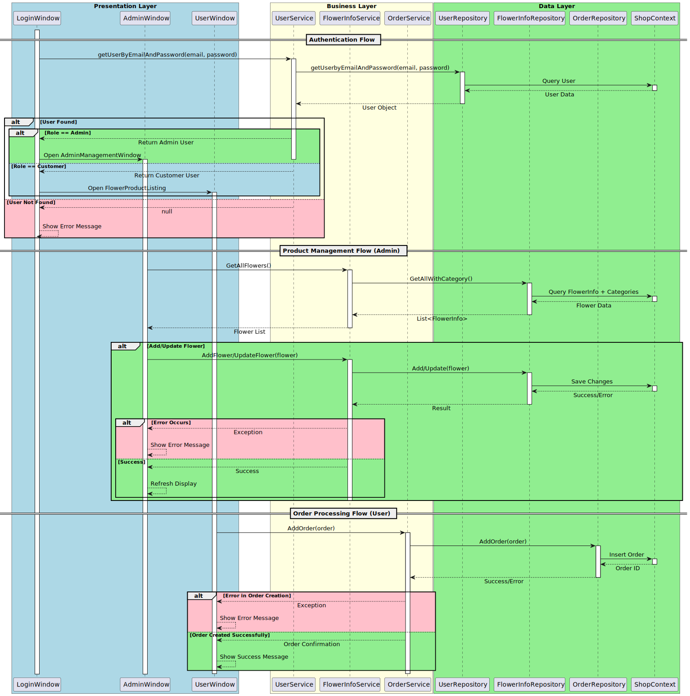

# Flower Shop

A WPF desktop application for managing a flower shop, featuring a modern UI and comprehensive shop management capabilities.



## Architecture Overview

The application follows a three-tier architecture:
- Presentation Layer (Shop_Flower) - WPF UI components
- Business Layer (Shop_Flower.BLL) - Business logic and services
- Data Layer (Shop_Flower.DAL) - Data access and entity models

### Key Components

1. Data Access Layer
   - ShopContext: EF Core DbContext for database operations
   - Repositories: CategoryRepository, FlowerInfoRepository, OrderRepository, UserRepository
   - Entities: Category, FlowerInfo, Order, User

2. Business Layer
   - Services: FlowerInfoService, CategoryService, OrderServices, UserService
   - Business logic implementation
   - Data validation and processing

3. Presentation Layer
   - Windows: AdminManagement, UserManagement, OrderManagement
   - XAML-based UI components
   - User input handling and validation

## Main Features

### 1. User Management
- Authentication and authorization
- Role-based access control (Admin/User)
- User profile management

### 2. Product Management
- Flower catalog management
- Category organization
- Inventory tracking
- Price management

### 3. Order Processing
- Order creation and management
- Order status tracking
- Order history

### 4. Admin Dashboard
- User management interface
- Product catalog administration
- Order management system
- Sales reporting

## Database Schema

### Tables
1. Users
   - UserID (PK)
   - Username
   - Password
   - Role

2. Categories
   - CategoryID (PK)
   - CategoryName

3. FlowerInfo
   - FlowerID (PK)
   - Name
   - Price
   - CategoryID (FK)
   - AvailableQuantity

4. Orders
   - OrderID (PK)
   - UserID (FK)
   - OrderDate
   - TotalPrice
   - Status

## Setup Instructions

### Prerequisites
1. .NET 8.0 SDK
2. SQL Server 2019 or later
3. Visual Studio 2022 or later

### Database Setup
1. Update connection string in `Shop_Flower/appsettings.json`:
   ```json
   {
     "ConnectionStrings": {
       "DefaultConnection": "Data Source=(local);Initial Catalog=Shop;User ID=sa;Password=1234567890;TrustServerCertificate=True"
     }
   }
   ```

2. Open Package Manager Console and run:
   ```
   Update-Database
   ```

### Application Setup
1. Clone the repository
2. Restore NuGet packages
3. Build the solution
4. Run the application

## Development Workflow

1. Data Layer Changes
   - Modify entities in Shop_Flower.DAL
   - Update ShopContext
   - Create/update migrations

2. Business Layer Changes
   - Implement business logic in services
   - Add validation rules
   - Update service interfaces

3. UI Layer Changes
   - Modify XAML views
   - Update view models
   - Add new windows/controls

## Testing

- Unit tests for business logic
- Integration tests for data access
- UI automation tests recommended

## Common Issues and Solutions

1. Database Connection
   - Verify SQL Server is running
   - Check connection string
   - Ensure proper permissions

2. Build Errors
   - Restore NuGet packages
   - Clean/Rebuild solution
   - Check .NET SDK version

## Contributing Guidelines

1. Fork the repository
2. Create a feature branch
3. Submit a pull request with:
   - Clear description
   - Unit tests
   - Documentation updates

## License

MIT License - See LICENSE file for details
