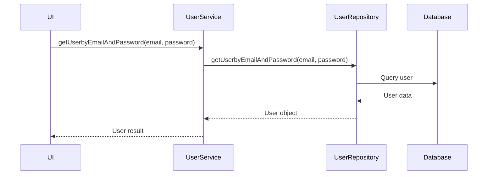
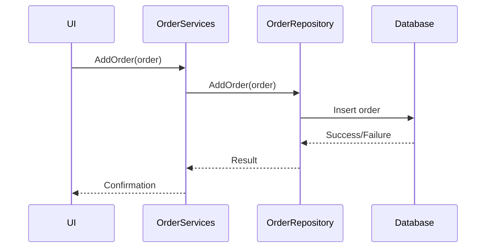

# Shop_Flower.BLL Component Documentation

## 1. Purpose and Responsibilities

The Shop_Flower.BLL component serves as the Business Logic Layer (BLL) for the flower shop application, handling:

- Business logic implementation
- Service interfaces and implementations
- Data validation and processing
- Transaction management
- Business rules enforcement

### Key Services:
- `UserService` - User authentication and management
- `FlowerInfoService` - Product catalog operations
- `CategoryService` - Category management
- `OrderServices` - Order processing
- `CartService` - Shopping cart operations

## 2. Dependencies

### Project Dependencies:
```xml
<ProjectReference Include="..\Shop_Flower.DAL\Shop_Flower.DAL.csproj">
    <Private>True</Private>
</ProjectReference>
```

### Core Dependencies:
- .NET 8.0
- Shop_Flower.DAL (Data Access Layer)

## 3. Main Flows

### Authentication Flow


### Order Processing Flow


## 4. Configuration Requirements

### Service Registration
```csharp
services.AddScoped<IUserService, UserService>();
services.AddScoped<IFlowerInfoService, FlowerInfoService>();
services.AddScoped<ICategoryService, CategoryService>();
services.AddScoped<IOrderServices, OrderServices>();
services.AddScoped<ICartService, CartService>();
```

### Required Repository Dependencies:
```csharp
services.AddScoped<IUserRepository, UserRepository>();
services.AddScoped<IFlowerInfoRepository, FlowerInfoRepository>();
services.AddScoped<ICategoryRepository, CategoryRepository>();
services.AddScoped<IOrderRepository, OrderRepository>();
services.AddScoped<ICartRepository, CartRepository>();
```

## 5. Usage Examples

### User Management
```csharp
// Authentication
public class LoginService {
    private readonly IUserService _userService;
    
    public User AuthenticateUser(string email, string password) {
        return _userService.getUserbyEmailAndPassword(email, password);
    }
}
```

### Product Management
```csharp
// Search products
public class ProductService {
    private readonly IFlowerInfoService _flowerService;
    
    public List<FlowerInfo> SearchProducts(string searchTerm) {
        return _flowerService.SearchFlower(searchTerm);
    }

    public void UpdateInventory(int flowerId, int quantity) {
        _flowerService.UpdateFlowerQuantity(flowerId, quantity);
    }
}
```

### Order Processing
```csharp
// Create new order
public class OrderProcessor {
    private readonly IOrderServices _orderService;
    private readonly ICartService _cartService;
    
    public void ProcessOrder(Order newOrder) {
        _orderService.AddOrder(newOrder);
        _cartService.ClearCart();
    }
}
```

The BLL component serves as the intermediary between the presentation layer and data access layer, ensuring business rules are enforced and data is properly validated before persistence.