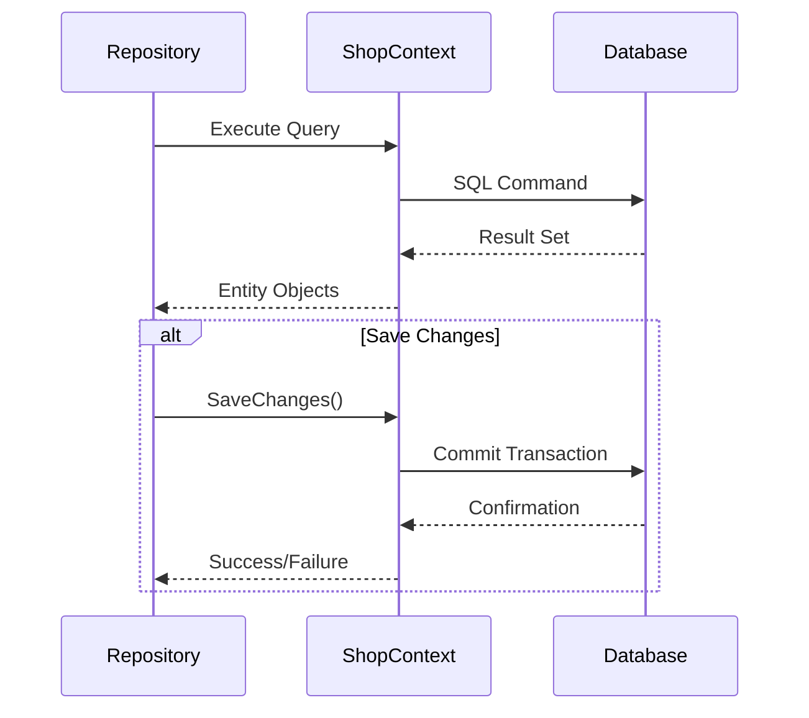
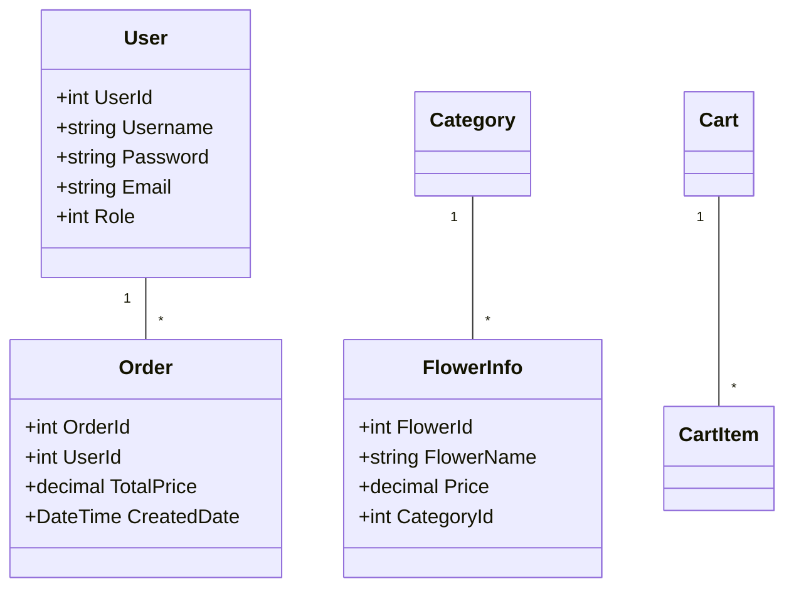

# Shop_Flower.DAL Component Documentation

## 1. Purpose and Responsibilities

The Shop_Flower.DAL (Data Access Layer) component is responsible for:
- Database interactions using Entity Framework Core
- Entity model definitions
- Repository pattern implementation
- Database context configuration
- CRUD operations for:
  - Users
  - Flowers
  - Categories
  - Orders
  - Shopping Cart

### Key Components
- **Entities**: Data models representing database tables
- **Repositories**: Data access implementations
- **Context**: EF Core DbContext configuration

## 2. Dependencies

```xml
<ItemGroup>
    <PackageReference Include="Microsoft.EntityFrameworkCore" Version="8.0.10" />
    <PackageReference Include="Microsoft.EntityFrameworkCore.SqlServer" Version="8.0.10" />
    <PackageReference Include="Microsoft.EntityFrameworkCore.Design" Version="8.0.10" />
    <PackageReference Include="Microsoft.EntityFrameworkCore.Tools" Version="8.0.10" />
    <PackageReference Include="Microsoft.Extensions.Configuration" Version="8.0.0" />
    <PackageReference Include="Microsoft.Extensions.Configuration.Json" Version="8.0.1" />
</ItemGroup>
```

## 3. Main Flows

### Database Operations Flow



### Entity Relationships



## 4. Configuration Requirements

### Database Connection
```json
{
    "ConnectionStrings": {
        "DefaultConnection": "Server=(local);Database=Shop;UID=sa;PWD=1234567890;TrustServerCertificate=True"
    }
}
```

### Repository Registration
```csharp
services.AddScoped<IUserRepository, UserRepository>();
services.AddScoped<IFlowerInfoRepository, FlowerInfoRepository>();
services.AddScoped<ICategoryRepository, CategoryRepository>();
services.AddScoped<IOrderRepository, OrderRepository>();
services.AddScoped<ICartRepository, CartRepository>();
```

## 5. Usage Examples

### User Repository Operations
```csharp
// Authentication
public User getUserbyEmailAndPassword(string email, string password)
{
    return _context.Users.FirstOrDefault(c => 
        c.Email == email && c.Password == password);
}

// User management
public void AddUser(User user)
{
    _context.Users.Add(user);
    _context.SaveChanges();
}
```

### Product Management
```csharp
// Get products with category
public List<FlowerInfo> GetAllWithCategory()
{
    return _context.FlowerInfos
        .Include(f => f.Category)
        .ToList();
}

// Update product
public void UpdateFlower(FlowerInfo flower)
{
    _context.FlowerInfos.Update(flower);
    _context.SaveChanges();
}
```

### Order Processing
```csharp
// Create order
public void AddOrder(Order order)
{
    _context.Orders.Add(order);
    _context.SaveChanges();
}

// Get user orders
public List<Order> GetOrdersByUserId(int userId)
{
    return _context.Orders
        .Where(order => order.UserId == userId)
        .ToList();
}
```

### Shopping Cart Operations
```csharp
public void AddToCart(CartItem item)
{
    var existingItem = _cart.Items
        .FirstOrDefault(i => i.FlowerId == item.FlowerId);
    if (existingItem != null)
    {
        existingItem.Quantity += item.Quantity;
    }
    else
    {
        _cart.Items.Add(item);
    }
}
```

The DAL component implements a clean repository pattern with Entity Framework Core, providing a robust data access layer for the flower shop application. It handles all database operations while maintaining separation of concerns and providing type-safe data access through strongly-typed entities.