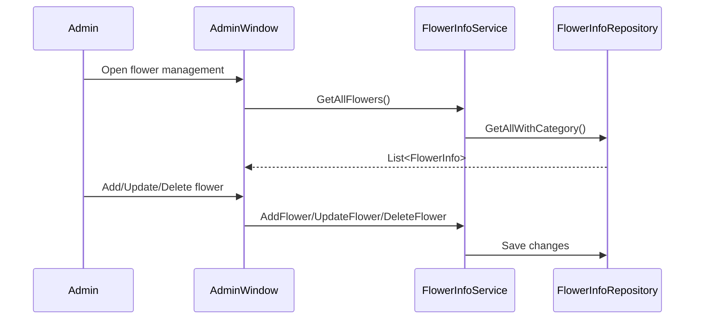
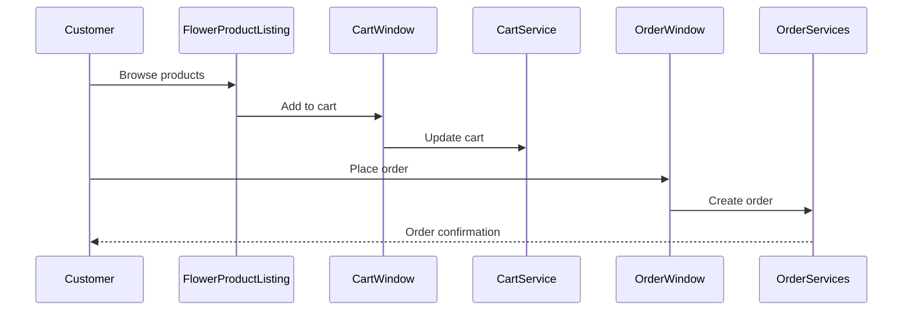

# Shop_Flower Component Documentation

## 1. Purpose and Responsibilities

The Shop_Flower component is the main WPF presentation layer of the flower shop application that provides:

- User authentication and role-based access (Admin/User)
- Product catalog browsing and management 
- Shopping cart functionality
- Order processing
- User management
- Category management

### Key Windows:
- `LoginWindow` - Authentication
- `AdminManagementWindow` - Admin dashboard
- `UserWindow` - Customer shopping interface 
- `CartWindow` - Shopping cart management
- `OrderWindow` - Order placement
- `FlowerProductListing` - Product catalog display

## 2. Dependencies

### External Packages:
```xml
<PackageReference Include="Blazorise.Icons.FontAwesome" Version="1.6.2" />
```

### Project Dependencies:
```xml
<ProjectReference Include="..\Shop_Flower.BLL\Shop_Flower.BLL.csproj">
    <Private>True</Private>
</ProjectReference>
```

### Services:
- `FlowerInfoService` - Product management
- `CategoryService` - Category management  
- `OrderServices` - Order processing
- `CartService` - Shopping cart
- `UserService` - User management

## 3. Main Flows

### Product Management Flow


### Shopping Flow


## 4. Configuration Requirements

### appsettings.json
```json
{
  "ConnectionStrings": {
    "Shop": "Data Source=(local);Initial Catalog=Shop;..."
  }
}
```

### Required Resources:
- `Font/Montserrat.ttf`
- `flower.jpg`

### Window Startup Configuration
```xaml
<Application x:Class="Shop_Flower.App"
             StartupUri="LoginWindow.xaml">
    <Application.Resources>
        <FontFamily x:Key="Montserrat">
            /Shop_Flower;component/Font/Montserrat.ttf#Montserrat
        </FontFamily>
    </Application.Resources>
</Application>
```

## 5. Usage Examples

### Admin Product Management
```csharp
// Add new flower
var addFlowerWindow = new AddUpdateFlowerWindow(categories);
if (addFlowerWindow.ShowDialog() == true)
{
    var newFlower = new FlowerInfo
    {
        FlowerName = addFlowerWindow.FlowerName,
        Price = addFlowerWindow.Price,
        // ... other properties
    };
    flowerInfoService.AddFlower(newFlower);
}
```

### Customer Shopping
```csharp
// Add item to cart
var item = new CartItem
{
    FlowerId = selectedFlower.FlowerId,
    FlowerName = selectedFlower.FlowerName,
    Price = selectedFlower.Price,
    Quantity = 1
};
_cartService.AddToCart(item);

// Place order
var orderWindow = new OrderWindow(userId, totalPrice);
orderWindow.Show();
```

The component follows MVVM architecture with separation of UI, business logic and data access layers. It provides a complete flower shop management solution with both admin and customer functionalities.